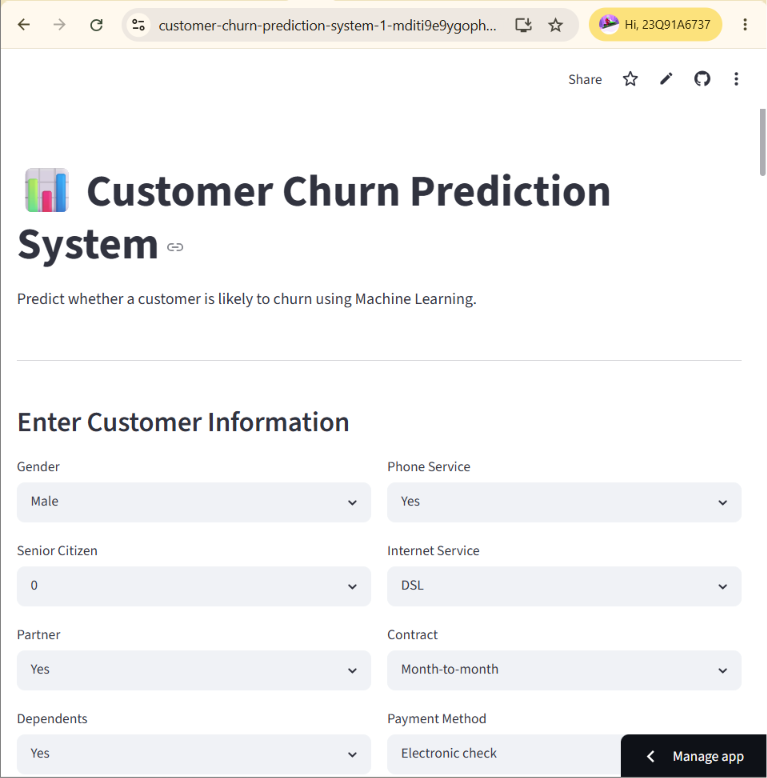
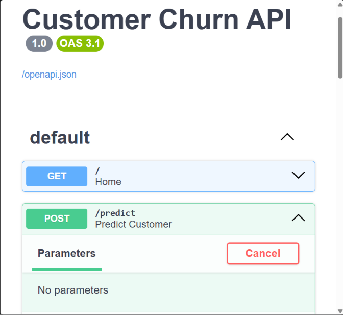

🚀 Customer Churn Prediction System

Predict customer churn using Machine Learning, Explainable AI, FastAPI, SQLite and Streamlit.

---

🌐 Live Demo

### Streamlit Application

[Open Streamlit App](https://customer-churn-prediction-system-1-mditi9e9ygophavbey5mp8.streamlit.app/)

### GitHub Repository

[GitHub Repository](https://github.com/aakash-data-science/customer-churn-prediction-system-1)

---

# 📷 Screenshots

## Dashboard

## Prediction Result

## FastAPI Swagger

---

# 📌 Project Overview

Customer churn is one of the biggest challenges faced by telecom companies.

Losing existing customers directly impacts revenue, customer acquisition costs, and long-term business growth.

This project presents an end-to-end Machine Learning solution capable of predicting customer churn and assisting businesses in identifying high-risk customers before they leave.

The system integrates:

- Machine Learning Pipeline
- Explainable AI
- Interactive Dashboard
- REST API
- Prediction History Database
- Batch Predictions
- Downloadable Reports
- Cloud Deployment

## 🎯 Business Objectives

- Predict customer churn probability
- Categorize customers into risk segments
- Support retention strategies
- Provide explainable predictions
- Enable large-scale batch predictions
- Maintain prediction history
- Offer downloadable business reports

# 📊 Dataset Information

Dataset Size

120,000 Telecom Customers

Features include:

- Gender
- Senior Citizen
- Partner
- Dependents
- Tenure
- Contract Type
- Internet Service
- Payment Method
- Monthly Charges
- Total Charges
- Streaming Services
- Security Services

Target Variable

Churn

No  → 0

Yes → 1

# ⚙ Machine Learning Pipeline
Data Cleaning
Missing Value Handling
Type Conversion
TotalCharges Cleaning
Feature Engineering

Customer behavior features

Risk indicators

Billing patterns

Tenure analysis

Preprocessing

StandardScaler

OneHotEncoder

ColumnTransformer

Pipeline

Train-Test Split

80% Training

20% Testing

Stratified Sampling

Cross Validation

5-Fold Cross Validation

Hyperparameter Tuning

GridSearchCV

Gradient Boosting Optimization

## 🤖 Models Compared

- Logistic Regression
- Random Forest
- Gradient Boosting

# 🏆 Best Model
Gradient Boosting Classifier

Performance Metrics

| Metric    | Score  |
|-----------|--------|
| Accuracy  | 72.37% |
| Precision | 71.24% |
| Recall    | 81.34% |
| F1 Score  | 75.95% |
| ROC AUC   | 78.39% |

# 🔥 Explainable AI

The project incorporates SHAP Explainability.

Features:

✔ Feature Contribution Analysis

✔ Local Explanations

✔ TreeExplainer

✔ Business Interpretability

## 📈 Visualizations

Implemented Visualizations:

- ROC Curve
- Confusion Matrix
- Feature Importance
- Customer Risk Segmentation
- SHAP Analysis

# 🌐 FastAPI Integration

Interactive API Documentation

http://127.0.0.1:8000/docs

Features

✔ REST API

✔ JSON Requests

✔ Risk Level Prediction

✔ Probability Scores

Example Response

{
"Prediction":"Will Churn",

"Risk Level":"Medium",

"Churn Probability":0.6933,

"Retention Probability":0.3067
}

# 💾 SQLite Database

Stores

Prediction History

Risk Levels

Timestamp

Probabilities

Database

database/

└── churn_history.db

# 📂 Batch Prediction

Upload CSV files

Predict thousands of customers

Download results

Business reporting

# 📥 Report Generation

Supported Downloads

CSV

Prediction Reports

Risk Analysis Reports

# 📊 Streamlit Dashboard

Features

Single Customer Prediction

Batch Prediction

SHAP Explainability

Prediction History

Download Reports

Interactive Charts

Business KPIs

# 🏗 Project Structure
customer_churn_project/

│
├── data/
│
├── database/
│
├── models/
│
├── src/
│
├── assets/
│
├── api.py
│
├── database.py
│
├── streamlit_app.py
│
├── requirements.txt
│
├── README.md
│
└── .gitignore

# 🛠 Tech Stack

Python

Pandas

NumPy

Scikit-Learn

SHAP

FastAPI

SQLite

Streamlit

Plotly

Matplotlib

Joblib

ReportLab

# ⚡ Installation

Clone Repository

git clone https://github.com/aakash-data-science/customer-churn-prediction-system-1.git

cd customer-churn-prediction-system-1

Install Dependencies

pip install -r requirements.txt

Run Streamlit

streamlit run streamlit_app.py

Run FastAPI

uvicorn api:app --reload

Swagger UI

http://127.0.0.1:8000/docs

# 🔮 Future Improvements

Docker Deployment

CI/CD Pipelines

AWS Deployment

Authentication

Automated Retraining

Monitoring

Model Drift Detection

# 👨‍💻 Author
Aakash

B.Tech CSE (Data Science)

JNTUH

GitHub

https://github.com/aakash-data-science

# ⭐ Support

If you found this project useful, consider giving it a ⭐ on GitHub.

Version

Customer Churn Prediction System v1.0